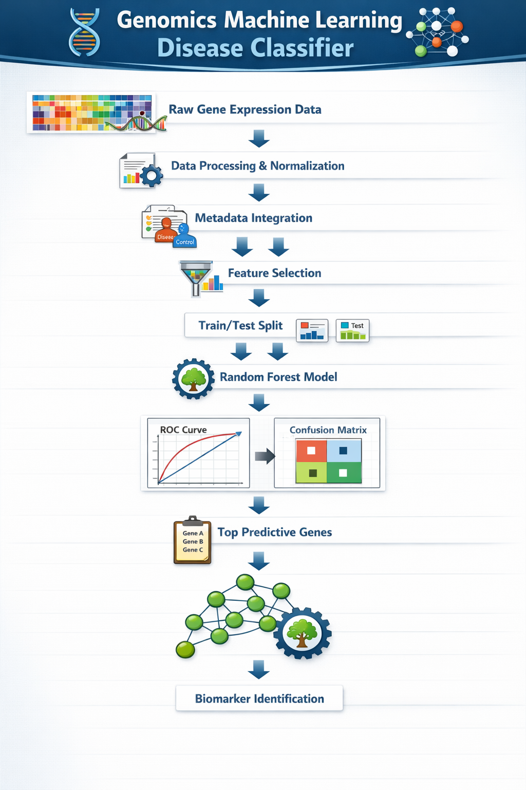

# 🧬 Genomics Machine Learning Disease Classifier

---

## 🔬 Project Overview

This project presents a complete machine learning pipeline for disease classification using transcriptomic RNA-seq gene expression data. The workflow integrates preprocessing, dimensionality reduction, supervised classification, model comparison, and biomarker discovery within a reproducible computational framework.

The objective is to evaluate whether gene expression profiles can reliably distinguish disease samples from healthy controls and to identify predictive genes associated with disease status.

---

## 🧪 Scientific Objective

To construct an interpretable machine learning model capable of predicting disease state from high-dimensional gene expression data and to identify candidate molecular biomarkers contributing to classification performance.

---

## 🧬 Dataset Description

• Data type: Normalized RNA-seq gene expression  
• Samples: 42  
• Features: ~50,000 genes  
• Task: Binary classification (Disease vs Control)  
• Challenge: High dimensionality with small sample size  

Feature selection was applied to reduce noise and improve model stability.

---

## ⚙️ Computational Pipeline

### 1️⃣ Data Preparation
Gene expression matrix merged with metadata and formatted for machine learning.

Output:
- data/processed/ml_dataset.csv

---

### 2️⃣ Feature Selection
Top 1000 informative genes selected based on statistical variance filtering.

Output:
- data/processed/ml_feature_selected.csv

---

### 3️⃣ Model Training

Two supervised models were developed:

Baseline Model  
• Random Forest classifier  
• Standard training configuration  

Improved Model  
• Tuned Random Forest  
• Cross-validation applied  

Outputs:
- models/random_forest_model.pkl
- models/random_forest_improved.pkl

---

### 4️⃣ Model Evaluation

Models were evaluated using multiple performance metrics.

Generated Results:
• ROC curve comparison  
• Precision–Recall curve comparison  
• Confusion matrix (baseline model)  
• Confusion matrix (improved model)  
• Model comparison metrics table  
• Performance comparison bar plot  

Outputs:
- results/roc_curve_comparison.png
- results/pr_curve_comparison.png
- results/confusion_matrix_baseline.png
- results/confusion_matrix_improved.png
- results/model_comparison_barplot.png
- results/model_comparison_metrics.csv

---

### 5️⃣ Biomarker Discovery

Feature importance analysis was used to extract the most predictive genes influencing classification outcomes.

Output:
- results/top_predictive_genes.csv

---

## 📊 Key Findings

• Machine learning models captured disease-associated transcriptomic patterns  
• Feature selection effectively reduced dimensionality  
• Predictive genes represent candidate molecular biomarkers  
• Model performance is limited by small sample size  
• Results reflect real-world challenges of high-dimensional genomics modeling  

---

## 📁 Repository Structure

genomics-ml-disease-classifier/

data/  
 raw/  
 processed/  

scripts/  
 01_prepare_ml_dataset.py  
 02_feature_selection.py  
 03_train_model.py  
 04_train_model_improved.py  
 05_model_evaluation.py  
 06_extract_top_genes.py  

models/  

results/  

assets/  
 pipeline_banner.png  

README.md

---

## ▶️ Reproducibility

Run the pipeline sequentially:

python scripts/01_prepare_ml_dataset.py  
python scripts/02_feature_selection.py  
python scripts/03_train_model.py  
python scripts/04_train_model_improved.py  
python scripts/05_model_evaluation.py  
python scripts/06_extract_top_genes.py

---

## 🔭 Future Directions

• Train models on large-scale transcriptomic cohorts  
• Apply deep learning architectures for feature representation  
• Integrate pathway enrichment analysis  
• Perform external dataset validation  
• Extend pipeline to multi-class disease prediction  
• Develop clinically interpretable biomarker panels  

---

## 👨‍💻 Author

Haseeb Ur Rehman  
Bioinformatics and Genomics Data Science

---

## 📜 License

Research and educational use only.
